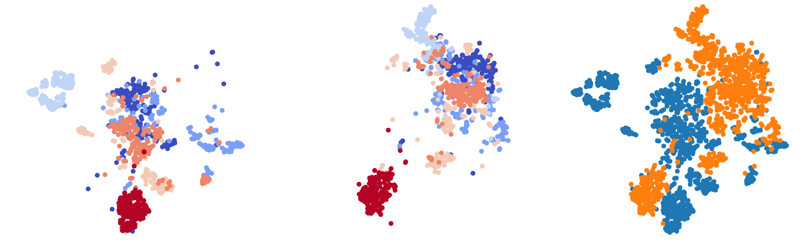

🥗 salad 
========

**S**\ emi-supervised **A**\ daptive **L**\ earning **A**\ cross **D**\ omains

``salad`` is a library to easily setup experiments using the current
state-of-the art techniques in domain adaptation. It features several of
recent approaches, with the goal of being able to run fair comparisons
between algorithms and transfer them to real-world use cases. The
toolbox is under active development and will extended when new
approaches are published.

Contribute and explore the code on `Github <https://github.com/domainadaptation/salad>`__.
For commonly asked questions, head to our `FAQ <https://github.com/domainadaptation/salad/wiki/FAQ>`_.

**Check out robusta, our new library for domain adaptation and robustness evaluation on ImageNet scale: https://github.com/bethgelab/robustness**

📊 Benchmarking Results
-----------------------

One of salad's purposes is to constantly track the state of the art of a variety of domain
adaptation algorithms. The latest results can be reproduced by the files in the ``scripts/``
directory.

.. figure:: img/benchmarks.svg
    :alt:

Code for reproducing these results can be found in the ``scripts/`` directory.
Usage is outlined below.

💻 Installation
---------------

Requirements can be found in ``requirement.txt`` and can be installed
via

.. code:: bash

    pip install -r requirements.txt

Install the package (recommended) via

.. code:: bash

    pip install torch-salad

For the latest development version, install via

.. code:: bash

    pip install git+https://github.com/domainadaptation/salad

📚 Using this library
---------------------

Along with the implementation of domain adaptation routines, this
library comprises code to easily set up deep learning experiments in
general. 

The toolbox currently implements the following techniques (in ``salad.solver``) that can be easily run with the provided example script.

-  VADA (``VADASolver``),
   `arxiv:1802.08735 <https://arxiv.org/abs/1802.08735>`__

   .. code:: bash

        $ python scripts/train_digits.py --source svhn --target mnist  --vada

-  Domain Adversarial Training (``DANNSolver``),
   `jmlr:v17/15-239.html <http://jmlr.org/papers/v17/15-239.html>`__

   .. code:: bash

        $ python scripts/train_digits.py --source svhn --target mnist  --dann  
    
    
-  Associative Domain Adaptation (``AssociativeSolver``),
   `arxiv:1708.00938 <https://arxiv.org/pdf/1708.00938.pdf>`__

   .. code:: bash

        $ python scripts/train_digits.py --source svhn --target mnist  --assoc  
    
    
- Deep Correlation Alignment

  .. code:: bash

    $ python scripts/train_digits.py --source svhn --target mnist  --coral  
    
-  Self-Ensembling for Visual Domain Adaptation
   (``SelfEnsemblingSolver``)
   `arxiv:1706.05208 <https://arxiv.org/abs/1706.05208>`__

   .. code:: bash

       $ python scripts/train_digits.py --source svhn --target mnist    --teach

-  Adversarial Dropout Regularization (``AdversarialDropoutSolver``),
   `arxiv.org:1711.01575 <https://arxiv.org/abs/1711.01575>`__

   .. code:: bash

       $ python scripts/train_digits.py --source svhn --target mnist  --adv  

Examples (already refer to the ``examples/`` subfolder) soon to be added for:

-  Generalizing Across Domains via Cross-Gradient Training
   (``CrossGradSolver``),
   `arxiv:1708.00938 <http://arxiv.org/abs/1804.10745>`__
   Example coming soon!

-  DIRT-T (``DIRTTSolver``),
   `arxiv:1802.08735 <https://arxiv.org/abs/1802.08735>`__

Implements the following features (in ``salad.layers``):

-  Weights Ensembling using Exponential Moving Averages or Stored
   Weights
-  WalkerLoss and Visit Loss
   (`arxiv:1708.00938 <https://arxiv.org/pdf/1708.00938.pdf>`__)
-  Virtual Adversarial Training
   (`arxiv:1704.03976 <https://arxiv.org/abs/1704.03976>`__)

Coming soon:

-  Deep Joint Optimal Transport (``DJDOTSolver``),
   `arxiv:1803.10081 <https://arxiv.org/abs/1803.10081>`__
-  Translation based approaches

Quick Start
~~~~~~~~~~~

To get started, the ``scripts/`` directory contains several python scripts
for both running replication studies on digit benchmarks and studies on
a different dataset (toy example: adaptation to noisy images).

.. code:: bash

    $ cd scripts
    $ python train_digits.py --log ./log --teach --source svhn --target mnist

Refer to the help pages for all options:

.. code::

    usage: train_digits.py [-h] [--gpu GPU] [--cpu] [--njobs NJOBS] [--log LOG]
                        [--epochs EPOCHS] [--checkpoint CHECKPOINT]
                        [--learningrate LEARNINGRATE] [--dryrun]
                        [--source {mnist,svhn,usps,synth,synth-small}]
                        [--target {mnist,svhn,usps,synth,synth-small}]
                        [--sourcebatch SOURCEBATCH] [--targetbatch TARGETBATCH]
                        [--seed SEED] [--print] [--null] [--adv] [--vada]
                        [--dann] [--assoc] [--coral] [--teach]

    Domain Adaptation Comparision and Reproduction Study

    optional arguments:
    -h, --help            show this help message and exit
    --gpu GPU             Specify GPU
    --cpu                 Use CPU Training
    --njobs NJOBS         Number of processes per dataloader
    --log LOG             Log directory. Will be created if non-existing
    --epochs EPOCHS       Number of Epochs (Full passes through the unsupervised
                            training set)
    --checkpoint CHECKPOINT
                            Checkpoint path
    --learningrate LEARNINGRATE
                            Learning rate for Adam. Defaults to Karpathy's
                            constant ;-)
    --dryrun              Perform a test run, without actually training a
                            network.
    --source {mnist,svhn,usps,synth,synth-small}
                            Source Dataset. Choose mnist or svhn
    --target {mnist,svhn,usps,synth,synth-small}
                            Target Dataset. Choose mnist or svhn
    --sourcebatch SOURCEBATCH
                            Batch size of Source
    --targetbatch TARGETBATCH
                            Batch size of Target
    --seed SEED           Random Seed
    --print
    --null
    --adv                 Train a model with Adversarial Domain Regularization
    --vada                Train a model with Virtual Adversarial Domain
                            Adaptation
    --dann                Train a model with Domain Adversarial Training
    --assoc               Train a model with Associative Domain Adaptation
    --coral               Train a model with Deep Correlation Alignment
    --teach               Train a model with Self-Ensembling

Reasons for using solver abstractions
~~~~~~~~~~~~~~~~~~~~~~~~~~~~~~~~~~~~~

The chosen abstraction style organizes experiments into a subclass of
``Solver``.

Quickstart: MNIST Experiment
~~~~~~~~~~~~~~~~~~~~~~~~~~~~

As a quick MNIST experiment:

.. code:: python

    from salad.solvers import Solver

    class MNISTSolver(Solver):

        def __init__(self, model, dataset, **kwargs):

            self.model = model
            super().__init__(dataset, **kwargs)

        def _init_optims(self, lr = 1e-4, **kwargs):
            super()._init_optims(**kwargs)

            opt = torch.optim.Adam(self.model.parameters(), lr = lr)
            self.register_optimizer(opt)

        def _init_losses(self):
            pass

For a simple tasks as MNIST, the code is quite long compared to other
PyTorch examples `TODO <#>`__.

💡 Domain Adaptation Problems
-----------------------------

Legend: Implemented (✓), Under Construction (🚧)

📷 Vision
~~~~~~~~~

-  Digits: MNIST ↔ SVHN ↔ USPS ↔ SYNTH (✓)
-  `VisDA 2018 Openset and Detection <http://ai.bu.edu/visda-2018>`__
   (✓)
-  Synthetic (GAN) ↔ Real (🚧)
-  CIFAR ↔ STL (🚧)
-  ImageNet to
   `iCubWorld <https://robotology.github.io/iCubWorld/#datasets>`__ (🚧)

🎤 Audio
~~~~~~~~

-  `Mozilla Common Voice Dataset <https://voice.mozilla.org/>`__ (🚧)

፨ Neuroscience
~~~~~~~~~~~~~~

-  White Noise ↔ Gratings ↔ Natural Images (🚧)
-  `Deep Lab Cut Tracking <https://github.com/AlexEMG/DeepLabCut>`__ (🚧)

🔗 References
--------------

If you use salad in your publications, please cite

.. code:: bibtex

  @misc{schneider2018salad,
     title={Salad: A Toolbox for Semi-supervised Adaptive Learning Across Domains},
     author={Schneider, Steffen and Ecker, Alexander S. and Macke, Jakob H. and Bethge, Matthias},
     year={2018},
     url={https://openreview.net/forum?id=S1lTifykqm}
  }

along with the references to the original papers that are implemented here.
   

Part of the code in this repository is inspired or borrowed from
original implementations, especially:

-  https://github.com/Britefury/self-ensemble-visual-domain-adapt
-  https://github.com/Britefury/self-ensemble-visual-domain-adapt-photo/
-  https://github.com/RuiShu/dirt-t
-  https://github.com/gpascualg/CrossGrad
-  https://github.com/stes/torch-associative
-  https://github.com/haeusser/learning\_by\_association
-  https://mil-tokyo.github.io/adr\_da/

Excellent list of domain adaptation ressources:

- https://github.com/artix41/awesome-transfer-learning

Further transfer learning ressources:

- http://transferlearning.xyz

👤 Contact
----------

Maintained by `Steffen Schneider <https://code.stes.io>`__. Work is part
of my thesis project at the `Bethge Lab <http://bethgelab.org>`__. This
README is also available as a webpage at
`salad.domainadaptation.org <http://salad.domainadaptation.org>`__. We
welcome issues and pull requests `to the official github
repository <https://github.com/bethgelab/domainadaptation>`__.
